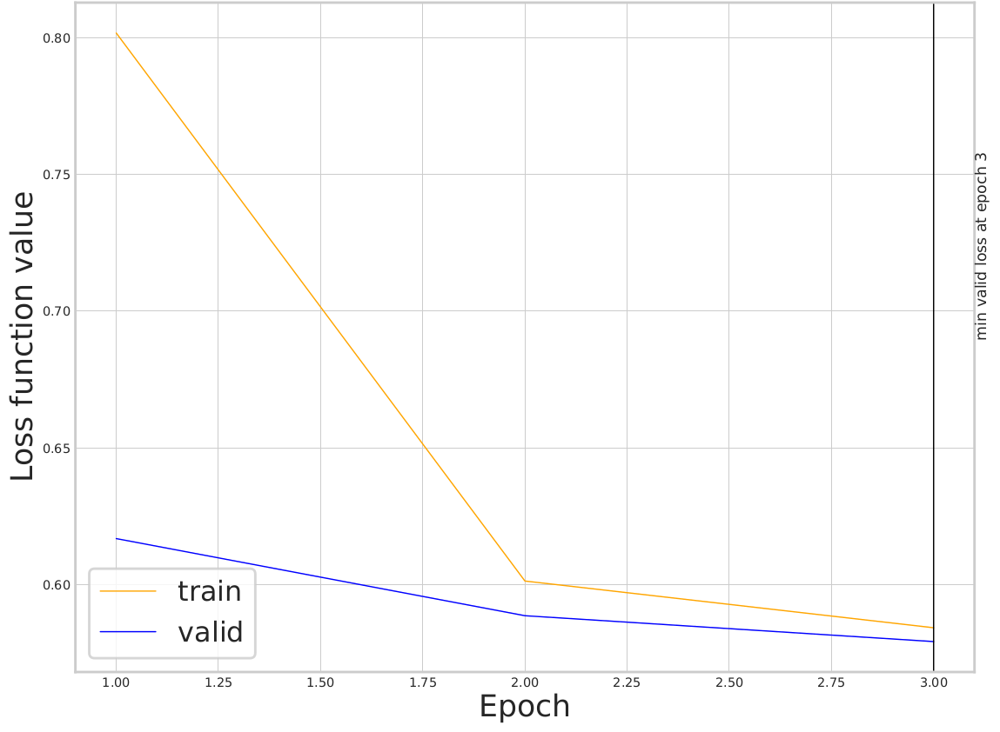

```{r, include = FALSE}
knitr::opts_chunk$set(
  collapse = TRUE,
  comment = "#>"
)
```

In this vignette, we'll use GCAE and its `example_tiny` example data, to train and use a GCAE neural network.

Here are the steps:

 * Setup GCAE
 * See the genetic data
 * See the GCAE model
 * Use GCAE for training

# Setup GCAE

First we determine if GCAE is installed.

To determine if GCAE is installed, we'll first load `gcaer`:

```{r setup}
library(gcaer)
```

Now `gcaer` can detect if GCAE is installed:

```{r is_gcae_installed}
good_to_go <- is_gcae_installed()
if (!good_to_go) {
  message("GCAE is not installed")
  message("Tip: use 'gcaer::install_gcae()'")
}
```

These are the GCAE options:

```{r gcae_options}
gcae_options <- create_gcae_options()
gcae_options
```

The GCAE options allow a user to select a GCAE version at a custom location.

## See the genetic data

These are the `example_tiny` files supplied with GCAE:

```{r data_dir}
if (good_to_go) {
  data_dir <- file.path(
    get_gcae_subfolder(gcae_options = gcae_options), 
    "example_tiny/"
  )
  list.files(data_dir)
}
```
Of these files, we will use `HumanOrigins249_tiny` as the base file name:

```{r base_filename}
if (good_to_go) {
  data <- "HumanOrigins249_tiny"
  list.files(data_dir, pattern = data)
}
```

We will be using the PLINK binary files, which are the `.bed`, `.bim` 
and `.fam` files.

This is the `.fam` file:

```{r read_fam_file}
n_individuals <- "[unknown]"
if (good_to_go) {
  fam_filename <- list.files(data_dir, full.names = TRUE, pattern = "\\.fam$")
  fam_table <- plinkr::read_plink_fam_file(fam_filename)
  n_individuals <- nrow(fam_table)
  knitr::kable(head(fam_table))
}
```

This table shows us the `r n_individuals` individuals.

This is the `.bim` file:

```{r read_bim_file}
n_snps <- "[unknown]"
if (good_to_go) {
  bim_filename <- list.files(data_dir, full.names = TRUE, pattern = "\\.bim$")
  bim_table <- plinkr::read_plink_bim_file(bim_filename)
  n_snps <- nrow(bim_table)
  knitr::kable(head(bim_table))
}
```

This table shows us the `r n_snps` SNPs.

This is the `.bed` file:

```{r read_bed_file}
if (good_to_go) {
  bed_filename <- list.files(
    data_dir, 
    full.names = TRUE, 
    pattern = "\\.bed$"
  )
  bed_table <- plinkr::read_plink_bed_file_from_files(
    bed_filename = bed_filename,
    bim_filename = bim_filename,
    fam_filename = fam_filename
  )
  testthat::expect_equal(n_individuals, ncol(bed_table))
  testthat::expect_equal(n_snps, nrow(bed_table))
  knitr::kable(head(bed_table[, 1:10]))
}
```

## See the GCAE setup

In this tutorial, we'll be using a standard GCAE setup.

```{r}
gcae_setup <- create_gcae_setup()
names(gcae_setup)
```

The GCAE setup contains the GCAE setup, such as the auto-encoder's
specification, training options and data options:

 * `model_id`: the setup of the auto-encoder
 * `train_opts_id`: the setup of the training of the auto-encoder
 * `data_opts_id`: the setup of the ?file storage? of the auto-encoder

Here we take a look at how each of these is set up.

### The model ID

```{r}
if (good_to_go) {
  model_filename <- get_gcae_model_filename(gcae_setup$model_id)
  testthat::expect_true(file.exists(model_filename))
  readr::read_lines(model_filename)
}
```

### train_opts_id

```{r}
if (good_to_go) {
  train_opts_filename <- get_gcae_train_opts_filename(gcae_setup$train_opts_id)
  testthat::expect_true(file.exists(train_opts_filename))
  readr::read_lines(train_opts_filename)
}
```

### data_opts_id

```{r}
if (good_to_go) {
  data_opts_filename <- get_gcae_data_opts_filename(gcae_setup$data_opts_id)
  testthat::expect_true(file.exists(data_opts_filename))
  readr::read_lines(data_opts_filename)
}
```

## Use GCAE for training

```{r}
if (good_to_go) {
  gcae_train(
    datadir = data_dir,
    data = data,
    gcae_setup = gcae_setup,
    epochs = 3,
    save_interval = 1,
    verbose = FALSE
  )
}
```


## Show neural network

```{r}
if (good_to_go) {
  gcae_output_subfolder <- get_gcae_output_subfolder(
    data = data,
    gcae_setup = gcae_setup,
    gcae_options = gcae_options
  )
  list.files(gcae_output_subfolder)
}
```



